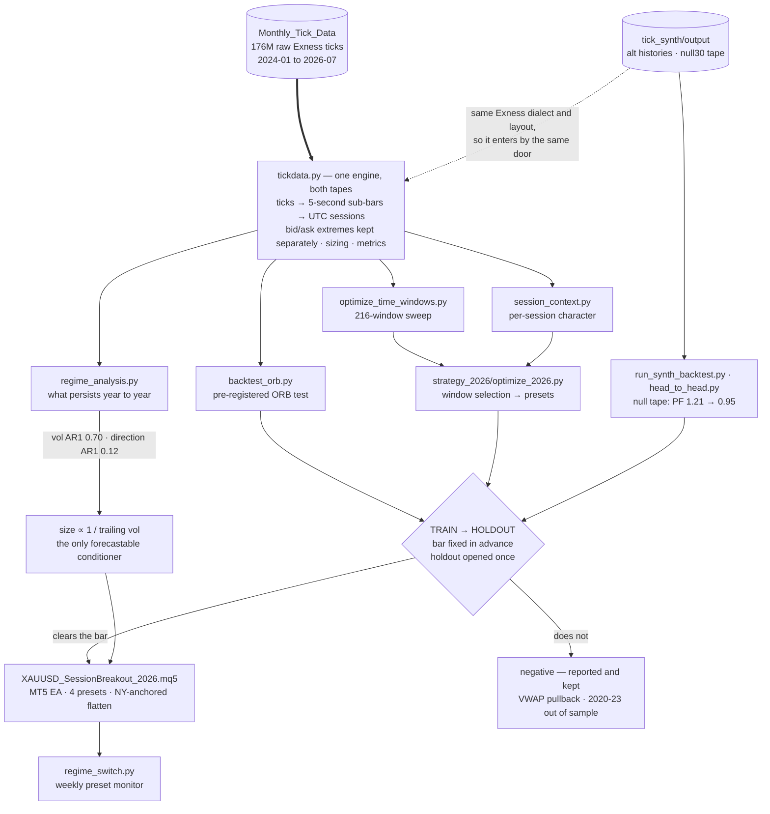
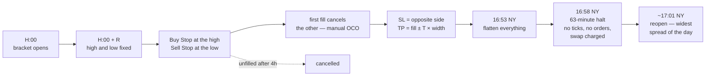

**English** · [Tiếng Việt](README.vi.md)

# xauusd-research

Strategy research on XAUUSD (spot gold) built directly on Exness raw tick data
— roughly 176 million ticks spanning 2024-01 to 2026-07 — plus `tick_synth`, a
synthetic tick generator for testing whether a result is an edge or a draw.

Every study here follows the same protocol, and the protocol is the point.

## How it fits together



The shape that matters: **one engine reads both tapes**. `tick_synth` writes in
the Exness dialect and directory layout, so a synthetic run enters through the
same `tickdata.py` path as real ticks with no code changes — which is what makes
the null-tape result mean anything. The gate is one-way, and the branch marked
*negative* is a real destination, not an error path: falsified strategies stay in
the repository with their numbers.

## The protocol

```
TRAIN    2024-01 .. 2025-06   (18 months)  — search here, freely
HOLDOUT  2025-07 .. 2026-06   (12 months)  — opened ONCE, for one config
```

A hypothesis is written down **before** any result is inspected, together with
the bar it has to clear: a minimum trade count, and a bootstrap confidence
interval on mean session P&L that lies wholly above zero. Only the single best
TRAIN candidate is scored out of sample. If nothing clears the bar on TRAIN,
the holdout stays shut and the answer is "no".

The full parameter grid is always reported, not just the winning cell, so the
family-level result stays visible rather than the luckiest member of it.

Costs are the real bid/ask spread carried in the tick data, plus commission.
Fills pay the correct side of the book.

## Strategies

**Opening range breakout** ([backtest_orb.py](backtest_orb.py)) — bracket the
high/low of the first R minutes after a session open, trade the first break,
stop at the opposite side, target a multiple of the range width. The prior is
microstructural: overnight information accumulates in thin liquidity and gets
repriced in a burst when a major session opens.

One window, from bracket to exit, and where the trading day ends:



The flatten is anchored to **New York, not UTC**. The Exness daily break follows
the 17:00 New York close, so in UTC it moves with US DST — 20:58 in summer,
21:58 in winter. A fixed UTC flatten lands *inside* the summer halt on ~66% of
trading days, where no tick arrives to trigger it and the close slips past the
swap charge to the reopen. Flattening five minutes before the halt is worth
+$192 (ORIGINAL) / +$385 (TUNED) over 2024-01…2026-07, and holds swap at zero.

## Layout

| path | what it is |
|---|---|
| [backtest_orb.py](backtest_orb.py) | pre-registered ORB test, 18-config grid |
| [tickdata.py](tickdata.py) | shared engine: ticks → sub-bars → sessions, sizing and metrics |
| [session_context.py](session_context.py) | per-session character table (trend/range, vol, spread) to join onto trades |
| [optimize_time_windows.py](optimize_time_windows.py) | 216-window ORB sweep (24 hours × 3 ranges × 3 targets), scored on both periods |
| [regime_analysis.py](regime_analysis.py) | what each year looked like, which characteristics persist, and a projection for the ones that do |
| [optimize_for_regime.py](optimize_for_regime.py) | conditions the ORB portfolio on volatility — the only forecastable input |
| [run_synth_backtest.py](run_synth_backtest.py) | runs the 8-window ORB portfolio across synthetic replicates |
| [XAUUSD_SessionBreakout.mq5](XAUUSD_SessionBreakout.mq5) | MT5 EA: the original 8-window portfolio |
| [strategy_2026/](strategy_2026/) | the live line — 2026 EA, NY-anchored flatten, preset switcher — see its own [README](strategy_2026/README.md) |
| [tick_synth/](tick_synth/) | synthetic tick generator — see its own [README](tick_synth/README.md) |

Results live in `orb_results/`, `regime_results/`, `market_context/`
and `spread_stats/`, and are committed as the research record.

## What regime_analysis established

This one result shapes everything downstream, so it belongs up front:

| forecastable (AR1 0.60–0.87) | not forecastable (AR1 ≤ 0.12) |
|---|---|
| realized volatility, range, spread, tick count | direction, trendiness |

So volatility level is the only legitimate thing to condition position sizing
or window selection on. The EA sizes inversely to trailing realized volatility
for exactly this reason. Anything that conditions on predicted *direction* is
fitting noise.

## tick_synth

One history is one draw, and the session-level bootstrap in these scripts
resamples sessions — it cannot resample the tape itself. `tick_synth` builds
synthetic tick files in the exact Exness dialect and directory layout, so any
backtest here reads them with no changes:

```bash
python backtest_orb.py --data-dir tick_synth/output/rep00 --outdir orb_results/rep00
```

Two uses. **Alternative histories** (whole-day blocks) give the spread of
outcomes an edge could have had. **A null tape** (short blocks) keeps real
costs, tick spacing and volatility but destroys multi-hour directional
structure — a breakout edge should largely die there, and if it doesn't, the
P&L is coming from something other than the stated mechanism.

Full method, validation numbers and gotchas: [tick_synth/README.md](tick_synth/README.md).

## Data

The tick data is **not** in this repository — it is ~19 GB of vendor data, and
the generated tapes and caches add ~64 GB more. All of it is gitignored.
Expected layout:

```
Monthly_Tick_Data/<YYYY>/Exness_XAUUSD_Raw_Spread_<YYYY>_<MM>/*.csv
```

```
"Exness","Symbol","Timestamp","Bid","Ask"
"exness","XAUUSD_Raw_Spread","2025-03-02 23:05:00.071Z",2873.618,2873.655
```

Synthetic runs are reproducible rather than stored: every output directory
carries a `manifest.json` recording the method, seed, source range and every
knob, so a deleted tape can be regenerated byte-for-byte.

## Requirements

Python 3.11+, `numpy`, `pandas`, `scipy`, `matplotlib`. The MT5 EA needs
MetaTrader 5 — read its header before running, `InpGMTOffsetHours` must match
your broker's server clock or it trades the wrong hours entirely.

## A caveat worth keeping

Synthetic tapes measure dispersion and robustness. They are not for
discovering an edge, and no parameter should ever be fitted on them.
