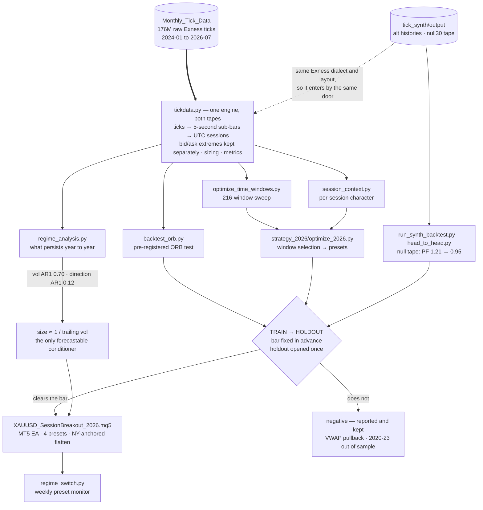
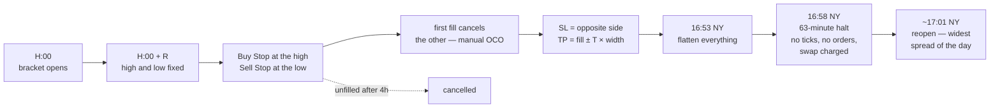

**English** · [Tiếng Việt](README.vi.md)

# xauusd-research

*An empirical study of intraday session-breakout structure in XAUUSD (spot
gold), conducted on raw tick data under a pre-registered testing protocol.*

## Abstract

This repository documents a systematic investigation of opening-range breakout
(ORB) behaviour in spot gold, using approximately 176 million raw bid/ask ticks
recorded by Exness between January 2024 and July 2026, together with a
supplementary archive covering 2020–2023 reserved for out-of-sample testing. A
synthetic tick generator (`tick_synth`) provides null and alternative-history
controls, permitting a distinction between a genuine directional effect and a
favourable realisation of a zero-edge process.

The central methodological commitment is that each hypothesis, together with
its acceptance criterion, is specified in advance of any out-of-sample
examination. Negative results are retained in the repository alongside positive
ones, and the complete parameter grid is reported rather than the selected
cell alone.

The principal findings are mixed and are stated as such. A session-breakout
effect is measurable in 2024–2026 and survives a synthetic null control, but it
fails to replicate on 2020–2023, a larger sample than that on which it was
constructed. Section 5 presents both results; Section 8 states the resulting
limitations.

---

## 1. System architecture

**Figure 1.** Data flow from raw ticks through the shared engine to the live
execution layer.



The architecturally significant property is that a single engine processes both
the empirical and the synthetic tape. `tick_synth` emits files in the Exness
dialect and directory layout, so a synthetic run traverses the same
`tickdata.py` path as recorded ticks without modification to any downstream
code. This equivalence is what licenses inference from the null-tape control in
§5.2: a difference in outcome cannot be attributed to a difference in
processing.

The acceptance gate is one-directional. The branch labelled *negative* is a
terminal state of the research process rather than an error condition;
falsified strategies remain in the repository together with the figures that
falsified them.

---

## 2. Data

The primary corpus consists of Exness raw-spread tick records for
`XAUUSD_Raw_Spread`, timestamped in UTC at millisecond resolution:

```
Monthly_Tick_Data/<YYYY>/Exness_XAUUSD_Raw_Spread_<YYYY>_<MM>/*.csv
```

```
"Exness","Symbol","Timestamp","Bid","Ask"
"exness","XAUUSD_Raw_Spread","2025-03-02 23:05:00.071Z",2873.618,2873.655
```

Ticks are aggregated into five-second sub-bars. Bid and ask extrema are
retained separately rather than collapsed to a mid-price series, so that exits
may be resolved against the correct side of the book.

The tick corpus is **not** distributed with this repository. It comprises
approximately 19 GB of vendor data, with generated tapes and caches accounting
for a further 64 GB; all are excluded via `.gitignore`. Derived results are
committed, and constitute the research record.

---

## 3. Methodology

### 3.1 Experimental protocol

```
TRAIN    2024-01 .. 2025-06   (18 months)  — unrestricted search
HOLDOUT  2025-07 .. 2026-06   (12 months)  — opened once, for one configuration
```

Each hypothesis is recorded before any result is inspected, together with the
criterion it is required to satisfy: a minimum trade count, and a bootstrap
confidence interval on mean session profit and loss lying wholly above zero.
Only the single best TRAIN candidate is evaluated out of sample. Where no
candidate satisfies the criterion on TRAIN, the holdout is not opened and the
hypothesis is recorded as rejected.

The full parameter grid is reported in every case, so that the family-level
result remains visible and the selected cell is not mistaken for an unbiased
estimate of its own performance.

### 3.2 Cost and execution model

Transaction costs are the bid/ask spread carried in the tick record itself,
plus commission; no synthetic or averaged spread is substituted. Long positions
exit on the bid and short positions on the ask. Where a stop and a target fall
within the same sub-bar, the stop is assumed to execute, yielding a
conservative estimate.

One cost is **not** modelled in the Python engine: overnight swap, charged at
the daily rollover at −$56.32 per lot on long positions, with short positions
free and a triple charge on Wednesdays. Profit and loss figures produced by the
Python engine are correspondingly optimistic by approximately 3.3%. The
`strategy_2026` flatten analysis (§5.4) does model swap explicitly.

### 3.3 Synthetic controls

A single observed history constitutes one draw, and the session-level bootstrap
implemented in these scripts resamples sessions rather than the underlying
tape. `tick_synth` addresses this by constructing synthetic tick files that any
backtest here reads without modification:

```bash
python backtest_orb.py --data-dir tick_synth/output/rep00 --outdir orb_results/rep00
```

Two constructions are used. **Alternative histories**, built from whole-day
blocks, characterise the dispersion of outcomes attainable by a given edge. A
**null tape**, built from short blocks, preserves realised costs, tick spacing
and volatility while destroying multi-hour directional structure. A breakout
effect should largely disappear on such a tape; persistence would indicate that
the measured profit arises from something other than the stated mechanism.

Method, validation figures and known pitfalls are documented in
[tick_synth/README.md](tick_synth/README.md).

---

## 4. Strategy specification

### 4.1 Opening-range breakout

For a window parameterised by anchor hour *H*, range length *R* minutes and
target multiple *T*: the high and low of the mid price over `[H:00, H:00+R)`
define a bracket. A buy stop is placed at the high and a sell stop at the low,
managed as a manual one-cancels-other pair. The stop loss is the opposite side
of the bracket; the take profit is the realised fill price offset by *T* times
the bracket width. Unfilled orders are cancelled four hours after the bracket
closes.

The motivating prior is microstructural: information accumulating overnight in
thin liquidity is repriced in a concentrated burst when a major session opens.

**Figure 2.** Lifecycle of a single window, and the termination of the trading
day.



### 4.2 Session boundary and position closure

Position closure is anchored to New York time rather than to UTC. The Exness
daily break follows the 17:00 New York close and therefore moves with United
States daylight saving time: it begins at 20:58 UTC under DST and 21:58 UTC
otherwise, in both cases lasting approximately 63 minutes. This is a property
of the *session schedule*; the server clock itself is UTC year-round, and the
two should not be conflated.

Quantitative treatment of the closure time is given in §5.4.

---

## 5. Results

### 5.1 Regime persistence

Estimated first-order autocorrelation of monthly series governs what may
legitimately be conditioned upon:

| forecastable (AR1 0.60–0.87) | not forecastable (AR1 ≤ 0.12) |
|---|---|
| realised volatility, range, spread, tick count | direction, trendiness |

Volatility level is therefore the only admissible conditioning variable for
position sizing or window selection, and the execution layer sizes inversely to
trailing realised volatility on this basis. Conditioning on forecast
*direction* would constitute fitting to noise, and no component of this study
does so.

### 5.2 Synthetic null control

On the `null30` tape, in which thirty-minute blocks destroy multi-hour
structure, the profit factor falls from 1.21 to 0.95 while trade count (5,021
against 5,010) and reward-to-risk ratio (1.98 against 2.04) are preserved. The
win rate alone collapses, from 37.2% to 32.4%, against a breakeven requirement
of 33.3%.

The 2024–2026 result is therefore not attributable to a cost artefact or an
implementation defect: it requires genuine directional persistence.

### 5.3 Out-of-sample failure, 2020–2023

The configuration was evaluated on 2020–2023, comprising 1,008 trading days and
approximately 7,750 trades — a larger sample than that on which it was
selected.

| configuration | profit factor | net |
|---|---|---|
| ORIGINAL | 0.93 | −$2,518 |
| TUNED | 0.95 | −$1,791 |

Annual profit factors were 0.85, 0.94, 1.02 and 0.95. The rank correlation of
hourly performance between the two eras is +0.048, indicating absence of the
mechanism rather than relocation of it. Neither transaction costs nor
volatility level accounts for the discrepancy: 2021 and 2022 exhibit
essentially the same relative range as 2024 while producing opposite outcomes.

The partition is clean in time rather than in market conditions. Every year in
2020–2023 yields a profit factor at or below 1.02, and every year in 2024–2026
at or above 1.17, with selection having been performed on 2024-01 to 2025-06.
This pattern is consistent with overfitting, and no evidence presently
distinguishes it from the alternative hypothesis that the effect emerged around
2024.

### 5.4 Session-boundary closure timing

The closure time was scanned as an offset preceding the daily halt, so that an
identical rule is evaluated in both daylight-saving regimes
([flatten_anchor.py](strategy_2026/flatten_anchor.py)). Net profit declines
monotonically as closure is advanced: for ORIGINAL, $11,897 at the halt against
$10,230 three hours before it.

The operative cost is swap rather than the post-reopen spread. Holding to the
reopen increases gross profit; the loss is incurred entirely through the swap
charge. The optimal rule is therefore to close at the latest moment preceding
the swap charge. Closure five minutes before the halt is adopted, the
unconstrained optimum being the halt itself but affording no execution margin
against a tick record that terminates at HH:57:58.

Relative to a fixed-UTC rule, the anchored rule is worth +$192 (ORIGINAL) and
+$385 (TUNED) over 2024-01 to 2026-07, and holds swap at exactly zero. The
improvement is unambiguous for the TUNED default; for ORIGINAL the prior
behaviour was marginally superior, and the result should not be generalised.

---

## 6. Repository structure

| path | contents |
|---|---|
| [backtest_orb.py](backtest_orb.py) | pre-registered ORB test, 18-configuration grid |
| [tickdata.py](tickdata.py) | shared engine: ticks → sub-bars → sessions, sizing and metrics |
| [session_context.py](session_context.py) | per-session characterisation (trend/range, volatility, spread) for joining onto trades |
| [optimize_time_windows.py](optimize_time_windows.py) | 216-window ORB sweep (24 hours × 3 ranges × 3 targets), scored on both periods |
| [regime_analysis.py](regime_analysis.py) | annual characterisation, persistence estimation, and projection of persistent quantities |
| [optimize_for_regime.py](optimize_for_regime.py) | conditions the ORB portfolio on volatility, the sole forecastable input |
| [run_synth_backtest.py](run_synth_backtest.py) | evaluates the 8-window ORB portfolio across synthetic replicates |
| [XAUUSD_SessionBreakout.mq5](XAUUSD_SessionBreakout.mq5) | MT5 expert advisor: the original 8-window portfolio |
| [strategy_2026/](strategy_2026/) | execution layer — 2026 EA, NY-anchored closure, preset switcher; see its own [README](strategy_2026/README.md) |
| [tick_synth/](tick_synth/) | synthetic tick generator; see its own [README](tick_synth/README.md) |

Results are committed under `orb_results/`, `regime_results/`,
`market_context/` and `spread_stats/`.

---

## 7. Reproducibility

Synthetic runs are regenerated rather than stored. Each output directory
carries a `manifest.json` recording the method, seed, source range and all
parameters, permitting byte-identical reconstruction of a deleted tape.

**Requirements.** Python 3.11 or later with `numpy`, `pandas`, `scipy` and
`matplotlib`. The expert advisor requires MetaTrader 5. `InpGMTOffsetHours`
must correspond to the broker's server clock; an incorrect value causes the
strategy to trade entirely different hours without any diagnostic.

---

## 8. Limitations

1. **The 2020–2023 failure is unresolved.** Either the effect emerged around
   2024, which is unfalsifiable with the data presently available, or the
   2024–2026 result is overfitted. Nothing in this study distinguishes the two.

2. **No second instrument has been tested.** The evidential asymmetry should be
   noted: confirmation on another instrument would be strong evidence, whereas
   failure would be weak, since gold-specific microstructure is plausible.

3. **Swap is unmodelled in the Python engine**, rendering its profit and loss
   figures optimistic by approximately 3.3% (§3.2).

4. **Replicate validation is close to circular.** Synthetic blocks are matched
   by time of day, so an hour that performed well in 2026 is reproduced as such
   in the replicates. These tests address day-ordering, not window selection.

5. **Synthetic tapes measure dispersion and robustness only.** They are not
   instruments of discovery, and no parameter is fitted on them.

6. Subjective confidence that a persistent, tradeable edge exists is
   approximately 30%, with expected live performance nearer a profit factor of
   1.05 than the 1.20 measured in sample. The strategy is **not deployed**;
   forward testing to date is on demonstration accounts only.

Only the existence of a real pattern *within the fitted window* has been
established here. Persistence beyond it has not.
