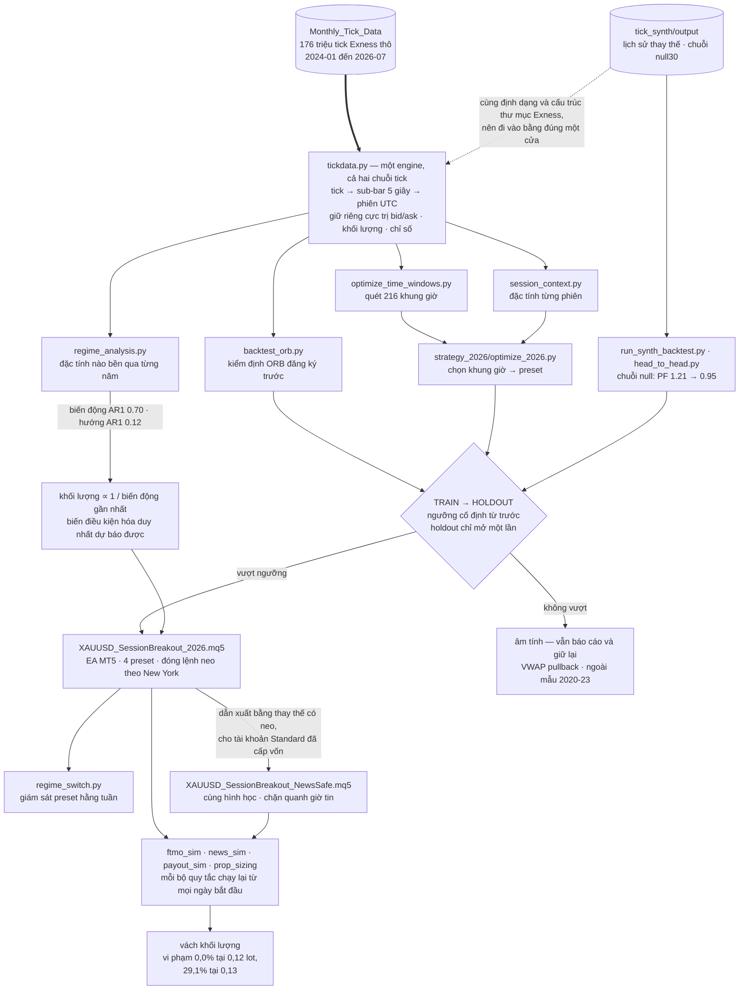
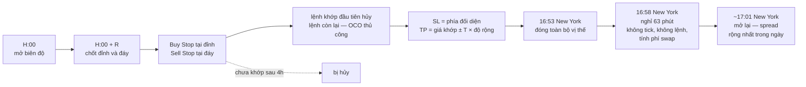

[English](README.md) · **Tiếng Việt**

# xauusd-research

*Một nghiên cứu thực nghiệm về cấu trúc phá vỡ biên độ mở phiên trong ngày trên
XAUUSD (vàng giao ngay), thực hiện trên dữ liệu tick thô theo một quy trình kiểm
định được đăng ký trước.*

## Tóm tắt

Repository này ghi lại một khảo sát hệ thống về hành vi phá vỡ biên độ mở phiên
(ORB) trên vàng giao ngay, sử dụng khoảng 176 triệu tick bid/ask thô do Exness
ghi nhận trong giai đoạn từ tháng 01/2024 đến tháng 07/2026, cùng với một kho dữ
liệu bổ sung giai đoạn 2020–2023 được dành riêng cho kiểm định ngoài mẫu. Bộ sinh
tick tổng hợp (`tick_synth`) cung cấp các đối chứng dạng null và dạng lịch sử
thay thế, cho phép phân biệt giữa một hiệu ứng định hướng thực sự và một lần
hiện thực hóa thuận lợi của một quá trình không có lợi thế.

Cam kết phương pháp luận trung tâm là: mỗi giả thuyết, cùng với tiêu chí chấp
nhận của nó, đều được xác định trước khi tiến hành bất kỳ khảo sát ngoài mẫu nào.
Các kết quả âm tính được giữ lại trong repository cùng với các kết quả dương
tính, và toàn bộ lưới tham số được báo cáo thay vì chỉ ô được chọn.

Các phát hiện chính là trái chiều và được trình bày đúng như vậy. Một hiệu ứng
phá vỡ theo phiên đo được trong giai đoạn 2024–2026 và vượt qua được đối chứng
null tổng hợp, nhưng không tái lập được trên giai đoạn 2020–2023 — một mẫu lớn
hơn chính mẫu đã dùng để xây dựng nó. Mục 5 trình bày cả hai kết quả; Mục 8 nêu
các hạn chế phát sinh từ đó.

Một câu hỏi phụ được xử lý riêng ở §4.3 và §5.5: với giả định hiệu ứng là có
thật, khối lượng vào lệnh nào sống sót được trước các giới hạn thua lỗ mà các
đơn vị cấp vốn áp đặt, và các quy định hạn chế giao dịch quanh tin tức của họ
tốn kém bao nhiêu. Phân tích đó độc lập với câu hỏi lợi thế có tồn tại hay
không, và nó kế thừa toàn bộ hạn chế của chính mẫu dữ liệu dùng để đo nó.

---

## 1. Kiến trúc hệ thống

**Hình 1.** Luồng dữ liệu từ tick thô qua engine dùng chung đến lớp thực thi.



Đặc điểm có ý nghĩa về mặt kiến trúc là một engine duy nhất xử lý cả chuỗi tick
thực nghiệm lẫn chuỗi tổng hợp. `tick_synth` xuất file đúng định dạng Exness và
đúng cấu trúc thư mục, nên một lần chạy tổng hợp đi qua đúng đường dẫn
`tickdata.py` như tick đã ghi nhận, không cần sửa bất kỳ đoạn mã nào phía sau.
Chính sự tương đương này cho phép suy luận từ đối chứng null ở §5.2: một khác
biệt về kết quả không thể quy cho khác biệt trong quá trình xử lý.

Cổng chấp nhận là một chiều. Nhánh mang nhãn *âm tính* là một trạng thái kết
thúc của quá trình nghiên cứu chứ không phải một lỗi; các chiến lược đã bị bác
bỏ vẫn nằm lại trong repository cùng với chính những con số đã bác bỏ chúng.

---

## 2. Dữ liệu

Kho dữ liệu chính gồm các bản ghi tick raw-spread của Exness cho
`XAUUSD_Raw_Spread`, đóng dấu thời gian theo UTC ở độ phân giải mili giây:

```
Monthly_Tick_Data/<YYYY>/Exness_XAUUSD_Raw_Spread_<YYYY>_<MM>/*.csv
```

```
"Exness","Symbol","Timestamp","Bid","Ask"
"exness","XAUUSD_Raw_Spread","2025-03-02 23:05:00.071Z",2873.618,2873.655
```

Tick được gộp thành các sub-bar 5 giây. Cực trị của bid và của ask được giữ
riêng chứ không quy về một chuỗi giá mid, để việc thoát lệnh có thể được xác
định trên đúng bên của sổ lệnh.

Kho tick **không** được phân phối kèm repository này. Nó chiếm khoảng 19 GB dữ
liệu từ nhà cung cấp, cùng với khoảng 64 GB nữa cho các chuỗi tick sinh ra và bộ
nhớ đệm; toàn bộ đã được loại trừ qua `.gitignore`. Các kết quả dẫn xuất được
commit và đóng vai trò hồ sơ nghiên cứu.

---

## 3. Phương pháp

### 3.1 Quy trình thực nghiệm

```
TRAIN    2024-01 .. 2025-06   (18 tháng)  — tìm kiếm không hạn chế
HOLDOUT  2025-07 .. 2026-06   (12 tháng)  — mở một lần, cho một cấu hình
```

Mỗi giả thuyết được ghi lại trước khi bất kỳ kết quả nào được xem xét, kèm theo
tiêu chí mà nó buộc phải thỏa mãn: số lệnh tối thiểu, và khoảng tin cậy bootstrap
của P&L trung bình mỗi phiên phải nằm hoàn toàn trên mức 0. Chỉ ứng viên tốt
nhất duy nhất trên TRAIN mới được đánh giá ngoài mẫu. Nếu không ứng viên nào
thỏa mãn tiêu chí trên TRAIN, holdout không được mở và giả thuyết được ghi nhận
là bị bác bỏ.

Toàn bộ lưới tham số luôn được báo cáo, để kết quả ở cấp độ cả họ chiến lược vẫn
hiện rõ và ô được chọn không bị nhầm thành một ước lượng không chệch cho chính
hiệu năng của nó.

### 3.2 Mô hình chi phí và khớp lệnh

Chi phí giao dịch là spread bid/ask có sẵn trong chính bản ghi tick, cộng hoa
hồng; không có spread tổng hợp hay spread trung bình nào được thay thế vào. Vị
thế mua thoát trên bid, vị thế bán thoát trên ask. Khi cắt lỗ và chốt lời cùng
rơi vào một sub-bar, cắt lỗ được giả định khớp trước, cho ra một ước lượng thận
trọng.

Có một khoản chi phí **không** được mô hình hóa trong engine Python: phí qua đêm
(swap), tính tại thời điểm đảo phiên hằng ngày, −56,32 USD mỗi lot đối với vị thế
mua, miễn phí đối với vị thế bán, và tính gấp ba vào thứ Tư. Do đó các con số
P&L do engine Python tạo ra lạc quan hơn thực tế khoảng 3,3%. Riêng phân tích
thời điểm đóng lệnh trong `strategy_2026` (§5.4) có mô hình hóa swap tường minh.

### 3.3 Đối chứng tổng hợp

Một lịch sử quan sát được chỉ là một lần rút ngẫu nhiên, và phép bootstrap ở cấp
phiên trong các script này lấy mẫu lại các phiên chứ không lấy mẫu lại chính
chuỗi tick nền. `tick_synth` giải quyết điều đó bằng cách dựng các file tick tổng
hợp mà mọi backtest ở đây đọc được không cần sửa đổi:

```bash
python backtest_orb.py --data-dir tick_synth/output/rep00 --outdir orb_results/rep00
```

Hai cấu trúc được sử dụng. **Lịch sử thay thế**, dựng từ các khối trọn ngày, mô
tả độ phân tán của các kết quả mà một lợi thế nhất định có thể đạt tới. **Chuỗi
tick đối chứng (null)**, dựng từ các khối ngắn, giữ nguyên chi phí thực, nhịp
tick và biến động, đồng thời phá bỏ cấu trúc định hướng kéo dài nhiều giờ. Một
hiệu ứng phá vỡ lẽ ra phải gần như biến mất trên chuỗi như vậy; nếu nó vẫn tồn
tại, điều đó cho thấy lợi nhuận đo được đến từ một nguyên nhân khác với cơ chế
đã nêu.

Phương pháp, số liệu kiểm định và các bẫy đã biết được ghi trong
[tick_synth/README.md](tick_synth/README.md).

---

## 4. Đặc tả chiến lược

### 4.1 Phá vỡ biên độ mở phiên

Với một khung giờ được tham số hóa bởi giờ neo *H*, độ dài biên độ *R* phút và
bội số mục tiêu *T*: đỉnh và đáy của giá mid trong khoảng `[H:00, H:00+R)` xác
định một biên độ. Một lệnh buy stop được đặt tại đỉnh và một lệnh sell stop tại
đáy, quản lý như một cặp one-cancels-other thủ công. Cắt lỗ đặt ở phía đối diện
của biên độ; chốt lời là giá khớp thực tế dịch đi *T* lần độ rộng biên độ. Các
lệnh chưa khớp bị hủy sau khi biên độ đóng bốn giờ.

Cơ sở của giả thuyết nằm ở vi cấu trúc thị trường: thông tin tích tụ qua đêm
trong điều kiện thanh khoản mỏng được định giá lại thành một đợt bùng nổ tập
trung khi một phiên chính mở cửa.

**Hình 2.** Vòng đời của một khung giờ, và thời điểm kết thúc ngày giao dịch.



### 4.2 Ranh giới phiên và việc đóng vị thế

Việc đóng vị thế được neo theo giờ New York chứ không theo UTC. Phiên nghỉ hằng
ngày của Exness bám theo giờ đóng cửa 17:00 New York, do đó theo giờ UTC nó dịch
chuyển cùng với giờ mùa hè (DST) của Hoa Kỳ: bắt đầu lúc 20:58 UTC trong giai
đoạn DST và 21:58 UTC ngoài giai đoạn đó, cả hai trường hợp đều kéo dài khoảng
63 phút. Đây là thuộc tính của *lịch phiên giao dịch*; bản thân đồng hồ máy chủ
là UTC quanh năm, và không được lẫn lộn hai điều này.

Xử lý định lượng cho thời điểm đóng vị thế được trình bày ở §5.4.

### 4.3 Hạn chế giao dịch quanh giờ công bố tin

Tài khoản *đã được cấp vốn* tại FTMO chịu một hạn chế mà cả hai vòng thử thách
đều không có: không được mở hay đóng vị thế trên một công cụ chịu ảnh hưởng của
USD trong phạm vi hai phút trước và sau sáu bản tin kinh tế Hoa Kỳ được nêu đích
danh. XAUUSD nằm trong nhóm đó thông qua USD. Hạn chế này ràng buộc cả các lệnh
chờ đang nằm sẵn, bởi một lệnh buy stop bị chạm trong cửa sổ đó vẫn được tính là
một lệnh mở, bất kể nó được đặt từ khi nào; và một lệnh cắt lỗ kích hoạt trong
cửa sổ đó được tính là một lệnh đóng. Chính đặc điểm này khiến ràng buộc trở nên
không tầm thường đối với một chiến lược đặt lệnh trước nhiều giờ rồi để yên.

`XAUUSD_SessionBreakout_NewsSafe.mq5` được dẫn xuất từ EA gốc bằng phép thay thế
có neo, giữ nguyên từng byte phần hình học vào lệnh ở §4.1, nên các kết quả ở §5
được kế thừa mà không cần ước lượng lại. Trước mỗi cửa sổ tin, EA rút các lệnh
chờ của mình và hoặc đóng vị thế đang mở, hoặc tháo cắt lỗ của nó, tùy
`InpNewsPosMode`; sau đó dựng lại biên độ nếu cửa sổ giao dịch vẫn còn hiệu lực.
Thời điểm công bố được lấy từ lịch kinh tế của MetaTrader, từ một lịch cố định
08:30/14:00 giờ New York khi nguồn đó rỗng, và từ một bảng mốc thời gian ngoại
tuyến. Việc quy đổi giờ New York sang UTC bám theo giờ mùa hè Hoa Kỳ chứ không
theo đồng hồ của sàn — hai mốc này lệch nhau ba tuần vào mùa xuân và một tuần
vào mùa thu.

Với danh mục mặc định `GEO_2026_NO_H13`, các bản tin 08:30 rơi vào khoảng trống
11:00–15:00 UTC giữa các cửa sổ đã kích hoạt nên không thể chạm tới một lệnh vào
nào; chỉ các bản tin 14:00 mới cắt qua một cửa sổ, vào khoảng mười sáu ngày mỗi
năm. Chi phí đo được trình bày ở §5.5.

---

## 5. Kết quả

### 5.1 Tính bền của chế độ thị trường

Hệ số tự tương quan bậc một ước lượng trên các chuỗi theo tháng quyết định điều
gì được phép dùng làm biến điều kiện hóa:

| dự báo được (AR1 0.60–0.87) | không dự báo được (AR1 ≤ 0.12) |
|---|---|
| biến động thực tế, biên độ, spread, số tick | hướng đi, độ xu hướng |

Do đó mức biến động là biến điều kiện hóa hợp lệ duy nhất cho việc xác định khối
lượng vào lệnh hay việc chọn khung giờ, và lớp thực thi tính khối lượng nghịch
đảo với biến động thực tế gần nhất trên cơ sở này. Điều kiện hóa theo *hướng* dự
báo sẽ là khớp nhiễu, và không thành phần nào trong nghiên cứu này làm như vậy.

### 5.2 Đối chứng null tổng hợp

Trên chuỗi `null30`, nơi các khối 30 phút phá bỏ cấu trúc nhiều giờ, hệ số lợi
nhuận giảm từ 1,21 xuống 0,95 trong khi số lệnh (5.021 so với 5.010) và tỷ lệ
lợi nhuận/rủi ro (1,98 so với 2,04) được giữ nguyên. Chỉ riêng tỷ lệ thắng sụp
đổ, từ 37,2% xuống 32,4%, so với ngưỡng hòa vốn 33,3%.

Vì vậy kết quả giai đoạn 2024–2026 không thể quy cho một sai lệch về chi phí hay
một lỗi cài đặt: nó đòi hỏi tính bền định hướng thực sự.

### 5.3 Thất bại ngoài mẫu, 2020–2023

Cấu hình được đánh giá trên giai đoạn 2020–2023, gồm 1.008 ngày giao dịch và
khoảng 7.750 lệnh — một mẫu lớn hơn chính mẫu đã dùng để chọn ra nó.

| cấu hình | hệ số lợi nhuận | lãi/lỗ ròng |
|---|---|---|
| ORIGINAL | 0,93 | −2.518 USD |
| TUNED | 0,95 | −1.791 USD |

Hệ số lợi nhuận theo từng năm lần lượt là 0,85; 0,94; 1,02 và 0,95. Tương quan
hạng của hiệu năng theo giờ giữa hai giai đoạn là +0,048, cho thấy cơ chế vắng
mặt chứ không phải dịch chuyển sang giờ khác. Cả chi phí giao dịch lẫn mức biến
động đều không giải thích được khác biệt này: năm 2021 và 2022 có biên độ tương
đối gần như bằng năm 2024 nhưng cho kết quả ngược chiều.

Sự phân tách là rõ ràng theo *thời gian* chứ không theo điều kiện thị trường.
Mọi năm trong 2020–2023 đều cho hệ số lợi nhuận không vượt quá 1,02, và mọi năm
trong 2024–2026 đều từ 1,17 trở lên, trong khi việc chọn khung giờ được thực
hiện trên giai đoạn 2024-01 đến 2025-06. Mẫu hình này nhất quán với hiện tượng
khớp quá mức (overfitting), và hiện chưa có bằng chứng nào phân biệt được nó với
giả thuyết thay thế rằng hiệu ứng mới xuất hiện vào khoảng năm 2024.

### 5.4 Thời điểm đóng vị thế tại ranh giới phiên

Thời điểm đóng vị thế được quét dưới dạng một độ lệch tính ngược từ phiên nghỉ
hằng ngày, để cùng một quy tắc được đánh giá trong cả hai chế độ giờ mùa hè
([flatten_anchor.py](strategy_2026/flatten_anchor.py)). Lợi nhuận ròng giảm đơn
điệu khi thời điểm đóng được đẩy lên sớm hơn: với ORIGINAL là 11.897 USD nếu
đóng ngay tại phiên nghỉ, so với 10.230 USD nếu đóng trước đó ba giờ.

Chi phí thực sự chi phối là swap chứ không phải spread sau khi mở lại. Việc giữ
vị thế đến lúc mở lại làm *tăng* lợi nhuận gộp; khoản lỗ phát sinh hoàn toàn qua
phí swap. Do đó quy tắc tối ưu là đóng vị thế ở thời điểm muộn nhất trước khi
swap bị tính. Phương án được chọn là đóng trước phiên nghỉ năm phút; điểm tối ưu
không ràng buộc chính là ngay tại phiên nghỉ, nhưng phương án đó không chừa biên
an toàn nào cho việc khớp lệnh, khi bản ghi tick kết thúc ở HH:57:58.

So với quy tắc cố định theo UTC, quy tắc neo theo New York đem lại +192 USD
(ORIGINAL) và +385 USD (TUNED) trong giai đoạn 2024-01 đến 2026-07, và giữ swap
ở đúng mức 0. Cải thiện này là rõ ràng đối với cấu hình mặc định TUNED; riêng
với ORIGINAL thì hành vi cũ nhỉnh hơn đôi chút, và kết quả không nên được khái
quát hóa.

### 5.5 Ràng buộc vốn và việc xác định khối lượng vào lệnh

Việc triển khai trên vốn của bên thứ ba áp đặt những giới hạn thua lỗ vốn không
phải là thuộc tính của chiến lược, và điều thực sự ràng buộc là *hình dạng* của
chúng chứ không phải độ lớn. Bốn bộ mô phỏng chạy lại từng bộ quy tắc trên cùng
một chuỗi giá đóng cửa và đáy trong ngày tính trên mỗi lot, xuất phát từ mọi
ngày bắt đầu khả dĩ thay vì đi theo một lộ trình duy nhất; vì vậy các tỷ lệ dưới
đây là tần suất trên tập các ngày bắt đầu, không phải ước lượng điểm từ một lần
chạy.

Các mức sàn khác nhau về bản chất. Mức lỗ tối đa của FTMO là 10%, tính *tĩnh* từ
số dư ban đầu; của E8 Signature là 4%, *trượt* theo đỉnh vốn cuối ngày. Ở cùng
một khối lượng, mức thứ nhất chứa được mức sụt giảm vốn của chiến lược này còn
mức thứ hai thì không — tỷ lệ vi phạm đo được là 0,0% so với 47,4%. Một mức sàn
trượt hẹp hơn chính mức sụt giảm vốn của chiến lược không phải là phiên bản nhỏ
hơn của một mức sàn tĩnh, mà là một ràng buộc khác hẳn.

Khối lượng trên tài khoản FTMO 2-Step 100.000 USD, với danh mục ORIGINAL, bộ lọc
tin ở §4.3, phụ phí thực thi 0,15 USD/oz so với mức nền Exness raw, tỷ lệ chia
lợi nhuận 80% và ngưỡng dừng lỗ trong ngày 4,5%
([lot_ladder_full.csv](strategy_2026/results/lot_ladder_full.csv), bốn mươi mức,
trích bảy):

| lot | sụt giảm tối đa | tỷ lệ đạt | số ngày trung vị | vi phạm | tiền mặt kỳ vọng |
|---|---|---|---|---|---|
| 0,10 | 6,32% | 80,0% | 142 | 0,0% | 11.647 USD |
| 0,11 | 6,95% | 84,2% | 130 | 0,0% | 13.672 USD |
| **0,12** | **7,58%** | **86,3%** | **122** | **0,0%** | **15.309 USD** |
| 0,13 | 8,21% | 87,2% | 108 | 29,1% | 14.106 USD |
| 0,14 | 8,84% | 86,1% | 98 | 34,9% | 14.093 USD |
| 0,16 | 13,34% | 83,4% | 89 | 43,4% | 15.255 USD |
| 0,17 | 13,61% | 84,0% | 84 | 43,5% | 16.330 USD |

Bước chuyển giữa 0,12 và 0,13 là gián đoạn, và cả khoảng 0,13–0,16 đều *bị
trội*: mọi mức trong khoảng đó đều cho tiền mặt kỳ vọng thấp hơn mức 0,12 trong
khi mang theo xác suất vi phạm từ 29% đến 43%. Tiền mặt kỳ vọng chỉ vượt được
con số của mức 0,12 khi lên tới 0,17, và khi đó xác suất vi phạm đã đạt 43,5%.
Do vậy mức lớn nhất không quan sát thấy vi phạm nào là 0,12 lot, tương đương
0,0012 lot trên mỗi 1.000 USD vốn danh nghĩa.

Một ngưỡng dừng lỗ cứng trong ngày không nới lỏng được ràng buộc này. Dưới
khoảng 0,145 lot nó không bao giờ kích hoạt; trên 0,16 nó *làm sâu thêm* mức sụt
giảm tối đa — từ 9,47% lên 13,34% chỉ qua một bước 0,01 — bởi những ngày mà nó
đóng lại thì một phần vốn dĩ đã hồi phục được. Nó được giữ lại như một lớp bảo
hiểm trước một ngày tệ hơn mọi ngày từng quan sát, chứ không phải như một giấy
phép để tăng khối lượng.

Bộ lọc tin ở §4.3 là một khoản chi phí chứ không phải một cải tiến, và độ lớn
của nó phi tuyến mạnh theo khối lượng. Ở mức 0,02 lot trên mỗi 10.000 USD, nó
loại 18 trong số 5.192 lệnh và làm tỷ lệ đạt thay đổi −0,30 điểm với tỷ lệ vi
phạm không đổi; ở mức 0,03 lot, cũng bộ lọc đó đẩy tỷ lệ vi phạm từ 58,0% lên
71,8%. Việc loại đi một số ít lệnh làm thay đổi *lộ trình* thực tế, và hành vi
gần một mức sàn thì không liên tục theo số lệnh bị loại. Không được phép ngoại
suy tuyến tính chi phí này; một ước lượng trước đó làm theo cách ấy đã đánh giá
thấp nó khoảng ba lần.

Một kết quả được báo cáo nhưng cố ý không áp dụng. Chặn *mọi* bản tin 08:30, chứ
không chỉ sáu bản tin được nêu đích danh, nâng tỷ lệ đạt của ORIGINAL lên 87,7%
và hạ tỷ lệ vi phạm xuống 0,0%
([news_sim.csv](strategy_2026/results/news_sim.csv), kịch bản `am_all`). Đây là
một bộ lọc được phát hiện trên chính mẫu dữ liệu dùng để đo nó, không có cơ chế
nào được đề xuất để giải thích, nên nó được ghi lại như một quan sát chứ không
được nhận làm quy tắc.

---

## 6. Cấu trúc repository

| đường dẫn | nội dung |
|---|---|
| [backtest_orb.py](backtest_orb.py) | kiểm định ORB đăng ký trước, lưới 18 cấu hình |
| [tickdata.py](tickdata.py) | engine dùng chung: tick → sub-bar → phiên, tính khối lượng lệnh và chỉ số |
| [session_context.py](session_context.py) | bảng đặc tính từng phiên (xu hướng/đi ngang, biến động, spread) để ghép vào lệnh |
| [optimize_time_windows.py](optimize_time_windows.py) | quét 216 khung giờ ORB (24 giờ × 3 biên độ × 3 mục tiêu), chấm trên cả hai giai đoạn |
| [regime_analysis.py](regime_analysis.py) | đặc tả từng năm, ước lượng tính bền, và dự báo cho các đại lượng có tính bền |
| [optimize_for_regime.py](optimize_for_regime.py) | điều kiện hóa danh mục ORB theo biến động, đầu vào duy nhất dự báo được |
| [run_synth_backtest.py](run_synth_backtest.py) | đánh giá danh mục ORB 8 khung giờ trên các bản sao tổng hợp |
| [XAUUSD_SessionBreakout.mq5](XAUUSD_SessionBreakout.mq5) | EA cho MT5: danh mục 8 khung giờ nguyên bản |
| [strategy_2026/ftmo_sim.py](strategy_2026/ftmo_sim.py) | FTMO so với E8 trên cùng một chuỗi ngày — sàn tĩnh so với sàn trượt |
| [strategy_2026/news_sim.py](strategy_2026/news_sim.py) | chi phí của bộ lọc tin ở §4.3, theo từng kịch bản chặn |
| [strategy_2026/payout_sim.py](strategy_2026/payout_sim.py) | tiền thực rút được từ tài khoản đã cấp vốn, kể cả trần rút từng đợt |
| [strategy_2026/prop_sizing.py](strategy_2026/prop_sizing.py) | thang khối lượng theo từng bộ quy tắc |
| [strategy_2026/us_macro_releases.csv](strategy_2026/us_macro_releases.csv) | 109 ngày công bố tin thực tế, để việc chặn rơi đúng vào ngày nó đã rơi |
| [strategy_2026/](strategy_2026/) | lớp thực thi — EA 2026, đóng lệnh neo theo New York, bộ chuyển preset; xem [README riêng](strategy_2026/README.md) |
| [tick_synth/](tick_synth/) | bộ sinh tick tổng hợp; xem [README riêng](tick_synth/README.md) |

Kết quả được commit trong `orb_results/`, `regime_results/`, `market_context/`
và `spread_stats/`.

---

## 7. Khả năng tái lập

Các lần chạy tổng hợp được tạo lại chứ không lưu trữ. Mỗi thư mục kết quả đều có
`manifest.json` ghi lại phương pháp, seed, khoảng dữ liệu nguồn và toàn bộ tham
số, cho phép dựng lại giống hệt từng byte một chuỗi tick đã bị xóa.

**Yêu cầu.** Python 3.11 trở lên với `numpy`, `pandas`, `scipy` và `matplotlib`.
EA cần MetaTrader 5. `InpGMTOffsetHours` phải khớp với đồng hồ máy chủ của sàn;
một giá trị sai sẽ khiến chiến lược giao dịch ở những khung giờ hoàn toàn khác
mà không phát ra bất kỳ cảnh báo nào.

**Trạng thái của EA.** `OnInit` không phải là sự kiện chỉ xảy ra một lần khi
triển khai: khởi động lại, kết nối lại, biên dịch lại và *mỗi lần đổi khung thời
gian của biểu đồ* đều đi vào đó. Vì vậy EA dựng lại trạng thái của ngày từ chính
các lệnh đang nằm trên máy chủ thay vì kích hoạt lại từ đầu, và lưu vốn đầu ngày
vào một biến toàn cục của terminal, đặt khóa theo magic number. Thiếu điều thứ
nhất, một lần đổi khung thời gian sẽ nhân đôi biên độ đang chạy; thiếu điều thứ
hai, mốc tính lỗ trong ngày bị lấy mẫu lại sau mỗi lần khởi động lại và giới hạn
sẽ âm thầm đo từ lúc khởi động lại chứ không phải từ đầu ngày.

---

## 8. Hạn chế

1. **Thất bại giai đoạn 2020–2023 vẫn chưa được giải thích.** Hoặc hiệu ứng mới
   xuất hiện vào khoảng năm 2024 — điều không thể kiểm chứng với dữ liệu hiện
   có — hoặc kết quả 2024–2026 là khớp quá mức. Không có gì trong nghiên cứu này
   phân biệt được hai khả năng đó.

2. **Chưa kiểm định trên công cụ thứ hai.** Cần lưu ý tính bất đối xứng về mặt
   bằng chứng: xác nhận được trên một công cụ khác sẽ là bằng chứng mạnh, còn
   thất bại lại là bằng chứng yếu, bởi một cấu trúc vi mô đặc thù của vàng là
   hoàn toàn hợp lý.

3. **Swap không được mô hình hóa trong engine Python**, khiến các con số P&L của
   nó lạc quan hơn thực tế khoảng 3,3% (§3.2).

4. **Kiểm định trên các bản sao gần như mang tính vòng quanh.** Các khối tổng hợp
   được ghép theo đúng thời điểm trong ngày, nên một giờ vốn cho kết quả tốt
   trong năm 2026 sẽ tái hiện y như vậy trong các bản sao. Các kiểm định này nói
   về thứ tự sắp xếp các ngày, không nói về việc chọn khung giờ.

5. **Chuỗi tick tổng hợp chỉ đo độ phân tán và độ bền.** Chúng không phải công cụ
   để phát hiện lợi thế, và không tham số nào được tối ưu trên chúng.

6. **Phân tích khối lượng ở §5.5 là có điều kiện, không độc lập.** Tỷ lệ đạt và
   tỷ lệ vi phạm là tần suất trên tập ngày bắt đầu trong giai đoạn 2024–2026 —
   đúng cửa sổ mà §5.3 cho thấy không tái lập được. Chúng trả lời câu hỏi *chuỗi
   lợi nhuận này chịu được khối lượng lớn đến đâu*, chứ không phải *chuỗi đó có
   lặp lại hay không*. Nếu hiệu ứng hóa ra chỉ là sản phẩm của cửa sổ đã khớp,
   thì không mức lot nào trong bảng đó là có căn cứ.

7. Mức tin cậy chủ quan rằng tồn tại một lợi thế bền vững, giao dịch được là
   khoảng 30%, với kỳ vọng hiệu năng thực tế gần hệ số lợi nhuận 1,05 hơn là mức
   1,20 đo được trong mẫu. Chiến lược **chưa được triển khai thật**; việc kiểm
   định tiến tới đến nay chỉ thực hiện trên tài khoản demo.

Nghiên cứu này mới chỉ thiết lập được sự tồn tại của một mẫu hình thực *bên
trong cửa sổ đã khớp*. Tính bền vững ra ngoài cửa sổ đó thì chưa.
